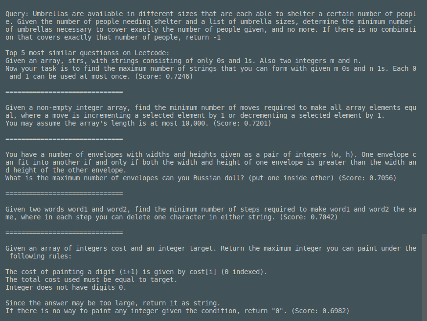

# Similar Coding Question Finder Using BERT

install sentence-transformers
## Installation
**Python 3.6** or higher, **[PyTorch 1.2.0](https://pytorch.org/get-started/locally/)** or higher and **[transformers v3.0.2](https://github.com/huggingface/transformers)** or higher. The code does **not** work with Python 2.7.

First, follow the installation for PyTroch you can find here: [PyTorch - Get Started](https://pytorch.org/get-started/locally/). As the provided models can have a high computational overhead, it is recommend to run them on a GPU. See the PyTorch page how to install PyTorch for GPU (CUDA).


**Install with pip**

Install the *sentence-transformers* with `pip`:
```
pip install -U sentence-transformers
```

**Install from sources**

Alternatively, you can also clone the latest version from the [repository](https://github.com/UKPLab/sentence-transformers) and install it directly from the source code:
````
pip install -e .
```` 

## Download pretrained model

Download the pretrained model from  **[here](https://drive.google.com/drive/folders/1XJu0DMI1nZzjJKEqBfzx4ErHkGU_0jH6?usp=sharing)** and place it in the folder

## Usage

**Use the new UI**


Run 
````
python UI.py
```` 
The first query may be very slow as it creates the embedding for all the questions on LeetCode, but queries after that should only takes seconds.

The "Tags" section gives a list similar questions' tags and their frequency. 

**Run it from terminal**

To use it run 
```
python main.py "your question here"
```

## Known issue

Due to an attempt to clean up the database by stripping away examples and implementation details, several questions became empty strings. So when given a short phrase, the output will be all empty strings.


## Fine tuning

The leetData.csv file includes pairs of coding questions from leetCode and a similarity score. It is created using my other repo, **[Leetcode_similar_question_scraper](https://github.com/Ericxu19/Leetcode_similar_question_scraper.git)**

running 
```
python train.py
```
will continus to train the model using the included dataset.

## Notes and graphes

The model is created by continuing to train a BERT model built for the sts benchmark using the leetcode dataset. 

The initial results seem positive

A simple change of subject which threw off google search and the orginal model trained on sts dataset was succesfullly detected by the new model.


However with a more complicated paraphrase, the model was unable to find the orginal question it was based on. But the similar questions it returned are all solved by dynamic programming, which is the way to solve the problem in the second query.


